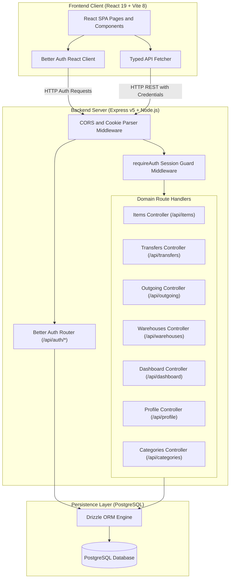
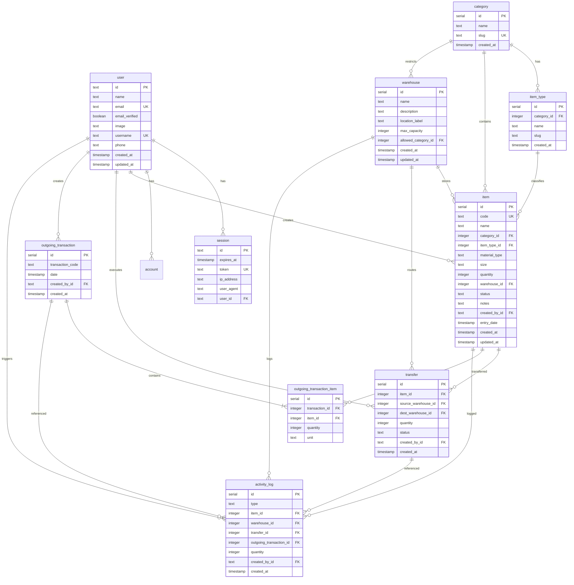
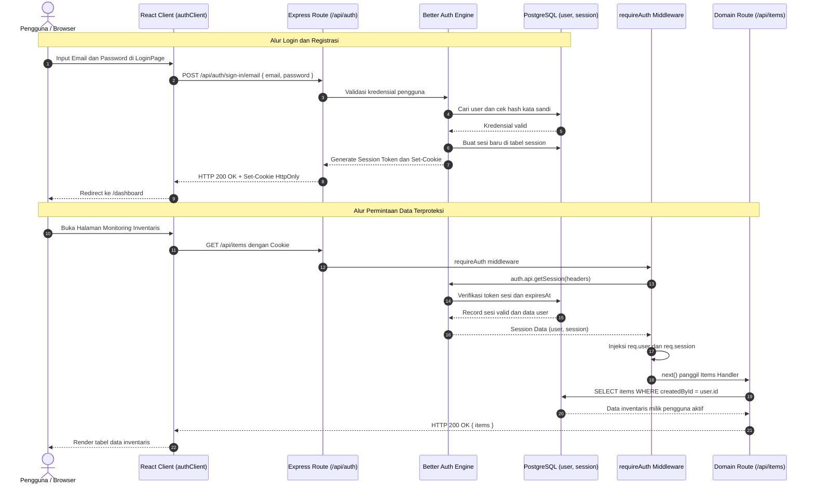

# 🏛️ Arsitektur Sistem GarmentFlow V2

> **Dokumen Spesifikasi Teknis, Desain Database, Alur Autentikasi, dan Katalog REST API.**  
> Dokumen ini ditujukan untuk Software Engineers, System Architects, dan Technical Leads yang ingin memahami, memelihara, atau mengembangkan lebih lanjut sistem **GarmentFlow V2**.

---

## 1. Ikhtisar Arsitektur Sistem (System Architecture Overview)

GarmentFlow V2 mengadopsi pola arsitektur **Decoupled Monorepo** yang memisahkan antarmuka pengguna (*Presentation Layer*) dari logika bisnis dan persistensi data (*Service & Data Access Layer*). Komunikasi antarlayer berlangsung secara *asynchronous* melalui RESTful API over HTTP(S) dengan mekanisme otorisasi berbasis *stateful session cookies*.



### Karakteristik Kunci Desain:
1. **Multi-tenant Data Isolation by User**: Seluruh inventaris (`item`), mutasi (`transfer`), transaksi barang keluar (`outgoing_transaction`), dan jejak audit (`activity_log`) terikat langsung ke `createdById` (ID user yang sedang aktif). Pengguna hanya dapat membaca dan memodifikasi data milik mereka sendiri.
2. **ACID Transactional Guarantees**: Operasi kritis seperti perpindahan barang antargudang dan transaksi keluar multi-item dibungkus di dalam `db.transaction()` untuk memastikan integritas kuantitas stok tanpa *race condition*.
3. **Capacity & Category Constraints**: Validasi gudang menolak perpindahan atau penambahan barang jika gudang tujuan melebihi `maxCapacity` atau memiliki aturan spesifik `allowedCategoryId` yang tidak sesuai dengan jenis kategori barang.

---

## 2. Arsitektur Database (Database Schema & ERD)

Database dimodelkan secara relasional di PostgreSQL dan dipetakan dengan presisi tipe TypeScript menggunakan **Drizzle ORM** (`apps/backend/src/db/schema.ts`).

### 2.1 Diagram Entitas Relasi (Entity Relationship Diagram)



---

### 2.2 Rangkuman Skema Tabel Utama

#### 1. Tabel Autentikasi (Better Auth Core)
- **`user`**: Menyimpan data identitas kredensial pengguna. Diperluas dengan kolom kustom `username` (unik) dan `phone`.
- **`session`**: Sesi login aktif berbasis token acak yang disimpan di database (`storeSessionInDatabase: true`), lengkap dengan rekaman `ipAddress`, `userAgent`, dan masa kedaluwarsa `expiresAt`.
- **`account`**: Menyimpan kredensial otentikasi (kata sandi ter-hash dan relasi penyedia akun).
- **`verification`**: Digunakan untuk alur verifikasi token dan email.

#### 2. Tabel Struktur & Master Data
- **`category`**: Master kategori pakaian tingkat atas (contoh: `Pakaian Atas` [slug: `top`], `Pakaian Bawah` [slug: `bottom`]).
- **`item_type`**: Master sub-kategori yang terikat pada `category_id` (contoh: Kaos, Kemeja, Polo, Celana Jeans, Rok).
- **`warehouse`**: Fasilitas penyimpanan fisik. Memiliki kapasitas maksimum (`maxCapacity`, default 1.000 pcs) dan pembatasan kategori opsional (`allowedCategoryId`). Jika bernilai `NULL`, gudang dapat menampung seluruh kategori (misalnya Gudang 3 Campuran).

#### 3. Tabel Inventaris & Transaksi
- **`item`**: Master produk inventaris pakaian. Memiliki kode SKU unik (`code`), nama, material kain, ukuran (`size`), jumlah fisik (`quantity`), referensi gudang, dan indikator status otomatis:
  - `AMAN`: Jumlah > 50 pcs.
  - `MENIPIS`: 21 ≤ Jumlah ≤ 50 pcs.
  - `KRITIS`: Jumlah ≤ 20 pcs (atau 0).
- **`transfer`**: Log perpindahan barang antargudang (`sourceWarehouseId` $\to$ `destWarehouseId`) dengan status `SUKSES` / `PENDING` / `GAGAL`.
- **`outgoing_transaction`**: Dokumen induk pengeluaran barang dengan nomor nota unik per user format `KB-XXXXX` (contoh: `KB-00056`).
- **`outgoing_transaction_item`**: Baris rincian barang yang dikeluarkan (Item ID, Kuantitas, Satuan: `Pcs`).
- **`activity_log`**: Audit trail terpadu untuk setiap pergerakan stok:
  - `MASUK`: Terpicu saat pembuatan barang baru atau penyesuaian stok positif.
  - `KELUAR`: Terpicu saat transaksi pengeluaran barang (`outgoing_transaction`) atau penyesuaian stok negatif.
  - `PINDAH`: Terpicu saat proses mutasi transfer antargudang berhasil diselesaikan.

---

## 3. Alur Autentikasi & Keamanan Sesi (Authentication Flow)

Sistem menggunakan **Better Auth** dengan adapter Drizzle ORM PostgreSQL. Mekanisme autentikasi berjalan sepenuhnya berbasis **HTTP-Only Cookies** untuk mengeliminasi kerentanan XSS (*Cross-Site Scripting*).



### Mekanisme Proteksi Middleware (`requireAuth`):
1. **Header Parsing**: Membaca cookie permintaan menggunakan `fromNodeHeaders(req.headers)`.
2. **Session Verification**: Memvalidasi validitas token dan waktu kedaluwarsa sesi terhadap tabel `session`.
3. **Context Injection**: Jika valid, menyematkan metadata pengguna ke dalam request context:
   ```typescript
   req.user = { id, name, email, username, phone, image };
   req.session = { id, userId, expiresAt };
   ```
4. **Rejection**: Jika token tidak ada atau tidak valid, langsung mengembalikan respons `401 Unauthorized` dengan pesan bahasa Indonesia yang ramah pengguna.
5. **Kustom Validasi Sign-Up**: Pada endpoint `POST /api/auth/sign-up/email`, server melakukan validasi pra-registrasi guna memastikan tidak ada duplikasi `email`, `name`, maupun `phone` sebelum didelegasikan ke engine Better Auth.

---

## 4. Katalog Endpoint REST API (API Specifications)

Seluruh endpoint bisnis berada di bawah prefiks `/api` dan mewajibkan sesi login aktif melalui cookie (`requireAuth`), kecuali endpoint `/api/health` dan `/api/auth/*`.

### 4.1 Autentikasi (`/api/auth`)
| HTTP Method | Endpoint | Auth | Parameter / Payload Utama | Deskripsi & Fungsi |
| :--- | :--- | :---: | :--- | :--- |
| `POST` | `/api/auth/sign-up/email` | Publik | `{ name, email, password, phone, username? }` | Mendaftarkan akun pengguna baru dengan validasi anti-duplikasi email, nama, dan no HP. |
| `POST` | `/api/auth/sign-in/email` | Publik | `{ email, password }` | Otentikasi pengguna, menerbitkan token sesi, dan menyematkan cookie ke browser. |
| `POST` | `/api/auth/sign-out` | Sesi | *None* | Menghapus sesi aktif dari database dan membersihkan cookie browser. |
| `GET` | `/api/auth/get-session` | Sesi | *None* | Mengambil payload data user dan masa aktif sesi yang sedang login. |

---

### 4.2 Dashboard & Analitik (`/api/dashboard`)
| HTTP Method | Endpoint | Auth | Parameter / Payload Utama | Deskripsi & Fungsi |
| :--- | :--- | :---: | :--- | :--- |
| `GET` | `/api/dashboard/stats` | Sesi | *None* | Mengembalikan metrik KPI: total jenis barang terdaftar, total akumulasi stok fisik, dan statistik okupansi per gudang. |
| `GET` | `/api/dashboard/activity-chart` | Sesi | Query: `?timeframe=week\|month` | Mengembalikan deret waktu agregasi kuantitas barang `MASUK` vs `KELUAR` per hari (7 hari) atau per bulan (6 bulan). |
| `GET` | `/api/dashboard/recent-activity`| Sesi | Query: `?limit=5` (max 50) | Mengambil daftar aktivitas mutasi terbaru (nama barang, gudang, kuantitas, tanggal). |

---

### 4.3 Manajemen Inventaris Barang (`/api/items`)
| HTTP Method | Endpoint | Auth | Parameter / Payload Utama | Deskripsi & Fungsi |
| :--- | :--- | :---: | :--- | :--- |
| `GET` | `/api/items` | Sesi | Query: `?page=1&limit=10&search=&warehouse=&category=&type=&size=&status=` | Mengambil daftar katalog barang terpaginasi dengan pencarian kode/nama dan multi-filter komprehensif. |
| `GET` | `/api/items/:id` | Sesi | Param: `id` | Mengambil detail spesifikasi satu barang beserta nama kategori, sub-tipe, dan nama gudang. |
| `POST` | `/api/items` | Sesi | Body: `{ code, name, categoryId, itemTypeId, materialType, size, quantity, warehouseId, notes }` | Menambahkan SKU barang baru, memverifikasi kompatibilitas gudang, dan otomatis menerbitkan log `MASUK`. |
| `PUT` | `/api/items/:id` | Sesi | Body: `{ code?, name?, categoryId?, itemTypeId?, materialType?, size?, quantity?, warehouseId?, notes? }` | Memperbarui informasi atribut produk atau memindahkan slot gudang item. |
| `PATCH`| `/api/items/:id/stock` | Sesi | Body: `{ adjustment: number }` | Menambah (angka positif) atau mengurangi (angka negatif) stok barang secara instan, lengkap dengan audit log. |
| `DELETE`| `/api/items/:id` | Sesi | Param: `id` | Menghapus barang inventaris (sekaligus membersihkan riwayat activity log dan transfer yang berelasi). |

---

### 4.4 Manajemen Pergudangan (`/api/warehouses`)
| HTTP Method | Endpoint | Auth | Parameter / Payload Utama | Deskripsi & Fungsi |
| :--- | :--- | :---: | :--- | :--- |
| `GET` | `/api/warehouses` | Sesi | *None* | Mengambil seluruh daftar gudang lengkap dengan kalkulasi stok terpakai, jumlah jenis item, persentase kapasitas, dan status okupansi (`STABIL`, `ZONA PERINGATAN`, `KAPASITAS KRITIS`). |
| `GET` | `/api/warehouses/:id` | Sesi | Param: `id` | Mengambil detail spesifik suatu gudang beserta sisa kuota kapasitas unit yang masih dapat ditampung. |

---

### 4.5 Perpindahan Barang Antargudang (`/api/transfers`)
| HTTP Method | Endpoint | Auth | Parameter / Payload Utama | Deskripsi & Fungsi |
| :--- | :--- | :---: | :--- | :--- |
| `GET` | `/api/transfers` | Sesi | Query: `?page=1&limit=10` | Mengambil riwayat mutasi perpindahan barang antargudang terpaginasi. |
| `POST` | `/api/transfers` | Sesi | Body: `{ itemId, sourceWarehouseId, destWarehouseId, quantity }` | **Eksekusi mutasi transaksional**: memvalidasi stok asal, memvalidasi sisa kapasitas & aturan kategori gudang tujuan, memotong stok asal, membuat/menambah stok di tujuan, dan mencatat log `PINDAH`. |

---

### 4.6 Pengeluaran Barang / Outgoing (`/api/outgoing`)
| HTTP Method | Endpoint | Auth | Parameter / Payload Utama | Deskripsi & Fungsi |
| :--- | :--- | :---: | :--- | :--- |
| `GET` | `/api/outgoing/next-code` | Sesi | *None* | Menghasilkan kode transaksi nota keluar berikutnya secara otomatis dan berurutan (contoh: `KB-00057`). |
| `POST` | `/api/outgoing` | Sesi | Body: `{ date?, items: [{ itemId, quantity }] }` | **Eksekusi pengeluaran multi-barang secara transaksional**: membuat header nota transaksi, rincian item, mengurangi kuantitas stok barang terkait, dan menerbitkan log `KELUAR`. |
| `GET` | `/api/outgoing/history` | Sesi | Query: `?page=1&limit=10&dateFrom=&dateTo=&type=&search=` | Mengambil riwayat komprehensif keluar-masuk barang dengan filter rentang tanggal, filter tipe (`Semua`, `MASUK`, `KELUAR`), dan pencarian teks. |

---

### 4.7 Kategori & Klasifikasi (`/api/categories`)
| HTTP Method | Endpoint | Auth | Parameter / Payload Utama | Deskripsi & Fungsi |
| :--- | :--- | :---: | :--- | :--- |
| `GET` | `/api/categories` | Sesi | *None* | Mengambil seluruh daftar kategori pakaian beserta relasi anak sub-tipe (`itemTypes`) untuk mengisi cascading dropdown pada form UI. |

---

### 4.8 Pengaturan Profil & Akun (`/api/profile`)
| HTTP Method | Endpoint | Auth | Parameter / Payload Utama | Deskripsi & Fungsi |
| :--- | :--- | :---: | :--- | :--- |
| `GET` | `/api/profile` | Sesi | *None* | Mengambil data detail profil pengguna yang sedang login. |
| `PUT` | `/api/profile` | Sesi | Body: `{ name?, username?, email?, phone? }` | Memperbarui informasi identitas profil pengguna dengan pengecekan keunikan email dan username. |
| `GET` | `/api/profile/stats` | Sesi | *None* | Mengambil ringkasan aktivitas pengguna (total aktivitas masuk/keluar dan total mutasi transfer yang telah dieksekusi). |
| `DELETE`| `/api/profile` | Sesi | *None* | **Penghapusan akun total**: Menghapus seluruh data pengguna secara berurutan (*cascading cleanup*: `activity_log` $\to$ `transfer` $\to$ `item` $\to$ `session` $\to$ `account` $\to$ `user`). |

---

### 4.9 System Health Check
| HTTP Method | Endpoint | Auth | Parameter / Payload Utama | Deskripsi & Fungsi |
| :--- | :--- | :---: | :--- | :--- |
| `GET` | `/api/health` | Publik | *None* | Memverifikasi ketersediaan server backend dan timestamp respon server. |

---

## 5. Ringkasan Integritas Transaksi & Validasi Bisnis

| Skenario Bisnis | Validasi & Aturan Sistem |
| :--- | :--- |
| **Kapasitas Gudang Penuh** | Sistem menolak transfer jika `quantity > destWarehouse.maxCapacity - destCurrentStock` dengan error code `400`. |
| **Restriksi Kategori Gudang** | Jika `warehouse.allowedCategoryId` terdefinisi (misal: Gudang 1 hanya Pakaian Atas), barang dari kategori lain akan otomatis ditolak. |
| **Pencegahan Stok Negatif** | Mutasi transfer atau transaksi keluar menolak operasi jika stok fisik tersedia kurang dari kuantitas yang diminta. |
| **Indikator Level Stok Otomatis** | Nilai kolom `status` pada tabel `item` dihitung secara dinamis saat *insert/update*: `KRITIS` (≤ 20 pcs), `MENIPIS` (21–50 pcs), dan `AMAN` (> 50 pcs). |
| **Isolasi Akun Multi-Pengguna** | Setiap kueri database pada modul barang, transaksi keluar, mutasi, dan dashboard memfilter dengan `createdById = req.user.id`, memastikan keamanan dan privasi data antar-pengguna. |
